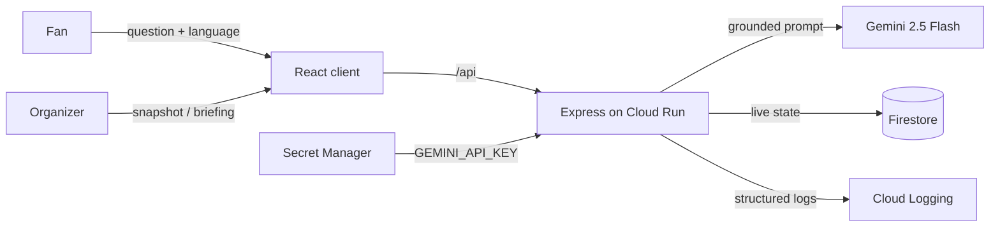

# StadiumIQ — Smart Stadiums & Tournament Operations

[](https://github.com/Rohitdey45/Smart-Stadiums-Tournament-Operations-Prompt-War-week-4/actions/workflows/ci.yml)
[](https://github.com/Rohitdey45/Smart-Stadiums-Tournament-Operations-Prompt-War-week-4/actions/workflows/codeql.yml)
[](LICENSE)
[](package.json)
[](#testing)

GenAI platform for the **FIFA World Cup 2026** that enhances both the fan
experience and venue operations at Estadio Azteca. Fans get multilingual,
grounded navigation, accessibility and transport help; organizers get live
crowd intelligence and AI-generated operational briefings for real-time
decisions.

**Repository:** <https://github.com/Rohitdey45/Smart-Stadiums-Tournament-Operations-Prompt-War-week-4>

---

## Chosen Vertical

**Smart Stadiums & Tournament Operations** (FIFA World Cup 2026), serving two
personas with one platform:

- **Fans** — a multilingual matchday assistant for navigation, accessibility,
  transport and venue questions (`/assistant`).
- **Organizers / venue staff** — an operations command center with live crowd
  density, incidents, sustainability metrics and AI decision support
  (`/operations`).

---

## Approach and Logic

1. **Ground the model, don't trust it.** Every Gemini call carries the
   authoritative venue dataset (gates, sections, facilities, transport,
   accessibility routes) in its prompt and is instructed to answer only from
   it. The assistant cannot invent a gate number — wrong wayfinding at a
   90,000-seat venue is worse than no answer.
2. **Decide from user context.** Each answer adapts to the question's language
   (five supported, validated at the boundary), and the grounded prompt
   instructs the model to lead with step-free routes and accessible options
   whenever a fan mentions a wheelchair, pram or reduced mobility. The briefing
   reads the _current_ live snapshot — zone densities, open incidents,
   sustainability trends — so recommendations change as the stadium state
   changes.
3. **Deterministic logic stays out of the LLM.** Crowd status
   (comfortable/busy/critical) is computed from occupancy thresholds in typed,
   unit-tested code; Gemini only turns the already-computed state into
   prioritized human recommendations. This keeps safety-relevant classification
   testable and repeatable.
4. **Fail closed and cheap.** Zod validates every input; errors map to one
   sanitized envelope; Gemini calls have timeouts, one retry and TTL caches so
   repeated questions don't re-bill or re-block.

---

## How the Solution Works

A fan (or organizer) opens the React client, served by the same Cloud Run
service that hosts the API. Questions go to `POST /api/assistant/ask`, where
zod validates the payload, the TTL cache is consulted, and a grounded prompt
(venue dataset + language + accessibility context) is sent to **Gemini 2.5
Flash**; the answer returns in the fan's language and is announced to screen
readers. The operations board polls `GET /api/operations/snapshot`, which reads
live zone/incident/sustainability state from **Firestore** (kept moving by a
telemetry simulator); "Generate AI Briefing" posts that snapshot to Gemini and
returns prioritized crowd, incident and sustainability actions. Full diagrams
and the request lifecycle are in [Architecture](#architecture) and
[docs/ARCHITECTURE.md](docs/ARCHITECTURE.md).

---

## Assumptions Made

- **Venue dataset is static for the event.** Gates, facilities and transport
  for Estadio Azteca are curated in code (`server/src/features/stadium/`);
  a real deployment would source them from a venue CMS.
- **Telemetry is simulated.** No live turnstile/IoT feed exists, so a
  deterministic simulator writes realistic zone/incident/sustainability state
  to Firestore (disable with `TELEMETRY_SIM_ENABLED=false`); the read path is
  identical to production.
- **Public kiosk model — no accounts.** Both surfaces are anonymous and
  read-only toward venue systems, so no authentication is required
  (rate-limited instead); the operations board would sit behind staff SSO in
  production (see [SECURITY.md](SECURITY.md)).
- **One stadium, five languages.** Scope is a single venue and the tournament's
  highest-traffic languages (en/es/fr/pt/ar); both are data, not architecture,
  and extend without code changes to routes or prompts.

---

## Problem Statement Alignment

> Build a GenAI-enabled solution that enhances stadium operations and the
> overall tournament experience for fans, organizers, volunteers, or venue
> staff during the FIFA World Cup 2026 — navigation, crowd management,
> accessibility, transportation, sustainability, multilingual assistance,
> operational intelligence, or real-time decision support.

Every requirement below is a working, demonstrable flow on the live URL.
Nothing ships that is not a row in this table.

| #   | Requirement (problem-statement theme) | How StadiumIQ delivers it                                                                                          | Live route               |
| --- | ------------------------------------- | ------------------------------------------------------------------------------------------------------------------ | ------------------------ |
| R1  | **Navigation**                        | Assistant gives grounded wayfinding — which gate serves a section, step-free routes to any facility                | `/assistant`             |
| R2  | **Crowd management**                  | Operations board shows per-zone density with comfortable/busy/critical status; AI briefing recommends redirections | `/operations`            |
| R3  | **Accessibility**                     | Accessible-route answers (Gate 6, elevators, sensory room) plus a WCAG 2.1 AA interface throughout                 | `/assistant` + whole app |
| R4  | **Transportation**                    | Assistant answers on metro, fan shuttle, bus, parking and rideshare, including accessible options                  | `/assistant`             |
| R5  | **Sustainability**                    | Live sustainability meters (waste diverted, energy, water refills, CO₂ saved) and AI sustainability actions        | `/operations`            |
| R6  | **Multilingual assistance**           | Assistant answers in English, Spanish, French, Portuguese and Arabic                                               | `/assistant`             |
| R7  | **Operational intelligence**          | Live operational snapshot (zones, incidents, sustainability) from Firestore, auto-refreshing                       | `/operations`            |
| R8  | **Real-time decision support**        | "Generate AI Briefing" turns the current live snapshot into prioritized crowd, incident and sustainability actions | `/operations`            |

---

## Features

- **Matchday Fan Assistant** (`/assistant`) — a multilingual chat grounded on
  the official venue dataset. Quick-action chips for the most common
  questions, a language selector, and answers that prioritize step-free and
  accessible options when mobility is mentioned.
- **Operations Command Center** (`/operations`) — a live board of zone crowd
  density, open incidents and sustainability metrics, refreshed on an
  interval, with an on-demand **AI Operations Briefing** that reads the
  current snapshot and returns prioritized recommendations.

---

## Architecture

Feature-folder monorepo (npm workspaces). Route handlers dispatch; feature
services hold logic; `lib/` holds pure, reusable utilities.

```text
stadiumiq/
├── server/                       Node 22 · Express 5 · TypeScript
│   └── src/
│       ├── config/               env (zod-validated) + constants
│       ├── lib/                  firestore · gemini · logger · app-error · ttl-cache
│       ├── middleware/           error-handler · validate(zod) · rate-limit
│       │                         · security(helmet + security.txt) · static-client
│       └── features/
│           ├── stadium/          venue grounding data + facilities API
│           ├── assistant/        multilingual grounded Q&A (Gemini)
│           └── operations/       live snapshot, telemetry sim, AI briefing
├── client/                       React 19 · TypeScript · Vite
│   └── src/
│       ├── components/           AppLayout · ErrorBoundary · StatusMessage
│       ├── lib/                  typed API client
│       └── features/
│           ├── home/             landing page
│           ├── assistant/        AssistantPage + hook + sub-components
│           └── operations/       OperationsPage + hook + sub-components
├── docs/decisions.md             architecture decision records
├── scripts/preflight.sh          pre-submission audit
└── Dockerfile                    multi-stage build → single Cloud Run service
```



### API

| Method + path                           | Purpose                                |
| --------------------------------------- | -------------------------------------- |
| `GET /api/health`                       | Liveness + version                     |
| `GET /api/stadium/facilities?category=` | Venue facilities for quick actions     |
| `POST /api/assistant/ask`               | Grounded, multilingual answer (Gemini) |
| `GET /api/operations/snapshot`          | Live zones, incidents, sustainability  |
| `POST /api/operations/briefing`         | AI operations briefing (Gemini)        |

---

## Tech Stack

React 19 · TypeScript 5.8 (strict) · Vite 7 · React Router 7 · Node 22 ·
Express 5 · Zod · `@google/genai` (Gemini 2.5 Flash) ·
`@google-cloud/firestore` · Helmet · Pino · Vitest · Testing Library ·
Playwright · Stryker · Cloud Run · Secret Manager · Firestore · Cloud Logging.

Contributors: see [CONTRIBUTING.md](CONTRIBUTING.md). Architecture:
[docs/ARCHITECTURE.md](docs/ARCHITECTURE.md) and
[docs/decisions.md](docs/decisions.md).

---

## Getting Started

```bash
# 1. Install (npm workspaces)
npm install

# 2. Configure environment
cp .env.example .env      # add your GEMINI_API_KEY

# 3. Run API (:8080) and client (:5173) in two terminals
npm run dev:server
npm run dev:client
```

Root scripts: `build` · `lint` · `typecheck` · `test` · `test:coverage` ·
`test:e2e` · `test:mutation` · `format`.

---

## Testing

Run `npm run test:coverage`. Coverage thresholds (95% lines, functions,
branches, statements) are enforced in each workspace's Vitest config, so CI
fails if coverage regresses; the suite currently measures **100% line coverage
in both workspaces**.

- **Server — 87 tests, 100% line coverage.** Unit tests for env validation,
  the TTL cache, the `AppError` type, the Gemini client (success, retry,
  sanitized failure), crowd/density logic, every middleware (validation,
  central error handling, static/SPA serving against a fixture build), and all
  feature services; zod schema boundary tests; full supertest integration
  tests covering every route, validation rejection, the sanitized 502 path,
  the hardened security headers, and the `/.well-known/security.txt`
  disclosure endpoint; plus a full matchday-journey test (health → venue →
  facilities → grounded answer → snapshot → briefing). Firestore is faked
  in-memory and Gemini is mocked for hermetic runs.
- **Client — 32 tests, 100% line coverage.** Testing Library tests for the
  full assistant flow (typed question, quick action, language passthrough,
  error state), the operations dashboard (live render, accessible density
  meters, snapshot error, briefing generation, in-flight double-request
  guard), lazy-loaded routing, the typed API client's error envelope
  handling, and the error boundary.
- **End-to-end — Playwright + axe-core.** Headless-Chromium smoke tests drive
  the critical fan-assistant and operations flows against the built client
  with the API mocked at the network boundary (`npm run test:e2e`), so they
  run hermetically in CI — and every flow ends with an **axe-core WCAG 2.1
  A/AA scan** that fails on any accessibility violation. A separate read-only
  live suite (`E2E_BASE_URL=<url> npm run test:e2e:live`, and the **E2E
  (live)** workflow) smoke-tests the deployed Cloud Run URL after each
  release.
- **Mutation testing — Stryker, ~91% score.** `npm run test:mutation` verifies
  the suite actually catches regressions rather than merely executing lines. It
  is scoped to the pure, deterministic domain logic (crowd/telemetry math, the
  TTL cache, the error model, async plumbing); the I/O-bound services and routes
  are covered by the supertest integration tests instead. It runs on its own
  non-blocking schedule.

---

## Security

See [SECURITY.md](SECURITY.md) for the full threat model.

- **Secrets** in Google Secret Manager, mounted via `--set-secrets`; nothing
  sensitive in the repo, image or git history. CI runs a gitleaks scan.
- **Input validation** with strict zod schemas at every boundary; unknown
  keys rejected, assistant question length-capped.
- **HTTP hardening**: Helmet with a restrictive CSP, an explicit CORS origin
  allowlist, a 100 kB JSON body limit, and layered rate limits (general +
  stricter on the Gemini endpoints).
- **Error hygiene**: one central handler returns sanitized `{ code, message }`
  bodies; stack traces and internal detail are logged server-side only.
- **Supply chain**: `npm audit --omit=dev --audit-level=high` → 0
  vulnerabilities, enforced as a CI step on every push; lockfile committed.
  Dependabot opens grouped weekly update PRs for npm and GitHub Actions.
- **Static analysis**: GitHub CodeQL (`security-extended` query pack) scans the
  code on every push, on pull requests, and weekly.
- **Least-privilege CI**: every workflow requests only `contents: read`.
- **Coordinated disclosure**: a vulnerability contact is published at
  `/.well-known/security.txt` (RFC 9116), served by an explicit route in
  [`server/src/middleware/security.ts`](server/src/middleware/security.ts).

---

## Performance

- Route-level code splitting: each persona page is lazily loaded, so the
  initial route ships ~78 kB gzip of JavaScript.
- `compression()` on responses; long-lived `Cache-Control` on content-hashed
  assets, `no-cache` on the HTML shell.
- Module-scope Gemini and Firestore clients reused across requests; every
  Gemini call has a timeout and one retry.
- In-memory TTL caches for repeated assistant questions and briefings.
- `--min-instances=1` keeps a warm instance for a sub-2s first response.
- **Lighthouse: Performance 100 and Best Practices 100 on the home route,
  Accessibility 100 on every route** of the live URL (Lighthouse 12.8.2;
  per-route scores and the reproduction command in
  [docs/lighthouse-results.md](docs/lighthouse-results.md)). Live API timings:
  snapshot ~0.4 s, assistant ~1.8 s, cached briefing ~0.3 s.

---

## Accessibility

Built to **WCAG 2.1 AA** and verified with axe and Lighthouse.

- Semantic landmarks (`header`, `nav`, `main`), a skip link, and one `h1` per
  route.
- Every control has a programmatic label; the app is fully keyboard operable
  with visible focus rings.
- Live regions (`aria-live`) announce assistant answers and briefings;
  density is exposed as an accessible `meter` with a descriptive label.
- Status is never colour-only (text tags accompany every colour); contrast
  meets 4.5:1 for text; `prefers-reduced-motion` is honoured.
- Multilingual answers are marked up correctly: each answer carries
  `dir="auto"` and a `lang` attribute (WCAG 3.1.2), so Arabic renders
  right-to-left and screen readers use the right phonetics — proven by a
  dedicated Playwright test asserting computed `direction: rtl` on real
  Arabic content.
- `jsx-a11y` rules enforced in lint; every E2E flow ends with an **axe-core
  WCAG 2.1 A/AA scan** that fails the suite on any violation.
- **Lighthouse Accessibility 100** on every route (home, `/assistant`,
  `/operations`) with zero audit failures — see
  [docs/lighthouse-results.md](docs/lighthouse-results.md). Lighthouse's
  accessibility audits run the axe-core ruleset; status colours were tuned to
  meet the 4.5:1 contrast bar.

---

## Google Cloud Integration

Each service is load-bearing, accessed through its official SDK.

| Service                      | Role in StadiumIQ                                                                                                  | Where                                                      |
| ---------------------------- | ------------------------------------------------------------------------------------------------------------------ | ---------------------------------------------------------- |
| **Cloud Run**                | Hosts the single containerized service (API + client), `--min-instances=1`/`--max-instances=3`, region asia-south1 | `Dockerfile`, [docs/ARCHITECTURE.md](docs/ARCHITECTURE.md) |
| **Gemini (`@google/genai`)** | Generates grounded multilingual answers and operations briefings                                                   | `server/src/lib/gemini.ts`                                 |
| **Firestore**                | Stores live operational state — zones, incidents, sustainability                                                   | `server/src/lib/firestore.ts`, `features/operations`       |
| **Secret Manager**           | Holds `GEMINI_API_KEY`, mounted via `--set-secrets`                                                                | deploy config                                              |
| **Cloud Logging**            | Receives structured JSON logs (severity-tagged) from stdout                                                        | `server/src/lib/logger.ts`                                 |

---

## Evaluation Map

Where each evaluation area is satisfied, so nothing has to be hunted for:

| Evaluation area                 | Evidence in this repo                                                                                                                                                                                                                                                                                                                                                                                                                 |
| ------------------------------- | ------------------------------------------------------------------------------------------------------------------------------------------------------------------------------------------------------------------------------------------------------------------------------------------------------------------------------------------------------------------------------------------------------------------------------------- |
| **Code Quality**                | Strict TypeScript (`tsconfig` `strict` + extras) · type-aware ESLint with zero warnings in CI (`--max-warnings=0`) · Prettier + `.editorconfig` · TSDoc on every export · feature-folder architecture ([docs/ARCHITECTURE.md](docs/ARCHITECTURE.md), [docs/decisions.md](docs/decisions.md)) · [CONTRIBUTING.md](CONTRIBUTING.md), [CHANGELOG.md](CHANGELOG.md), PR/issue templates, CODEOWNERS · conventional commits, single branch |
| **Security**                    | [SECURITY.md](SECURITY.md) threat model · Secret Manager for keys · zod at every boundary · Helmet CSP, CORS allowlist, rate limits, body caps · gitleaks + `npm audit` + CodeQL + Dependabot in CI · `security.txt` ([Security](#security))                                                                                                                                                                                          |
| **Efficiency**                  | Route-level code splitting (~78 kB gzip first route) · compression + cache headers · TTL caches · warm Cloud Run instance · Lighthouse Performance 100 on the home route ([Performance](#performance))                                                                                                                                                                                                                                |
| **Testing**                     | 100% line coverage (95% floors enforced in config) · unit + integration (supertest) + E2E (Playwright, hermetic and live suites) + mutation testing (Stryker) · all wired into CI ([Testing](#testing))                                                                                                                                                                                                                               |
| **Accessibility**               | WCAG 2.1 AA: landmarks, labels, keyboard, live regions, contrast · `jsx-a11y` lint · axe-core checks in E2E · Lighthouse Accessibility 100 ([Accessibility](#accessibility))                                                                                                                                                                                                                                                          |
| **Problem Statement Alignment** | R1–R8 traceability table with a live route per requirement ([Problem Statement Alignment](#problem-statement-alignment))                                                                                                                                                                                                                                                                                                              |

---

## Team

Built by Rohit Dey for Hack2skill PromptWars Virtual — Week 4.

Licensed under the [MIT License](LICENSE).
